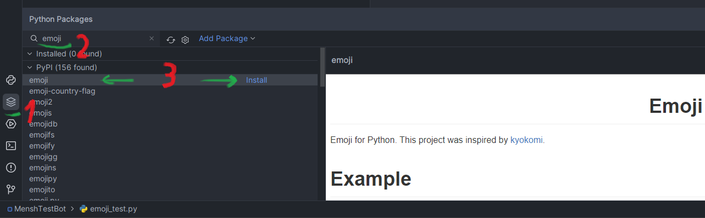

## Как использовать эмодзи

### 1. Библиотека emoji

[Документация](https://carpedm20.github.io/emoji/docs/index.html)

#### Установка

В PyCharm:


В терминале:
```python -m pip install emoji --upgrade```

Если на маке или линуксе *python3* вместо *python*.

#### Как использовать

Метод ```emojize(текст с кодом)```: :код: -> 👌

Метод ```demojize(текст с эмодзи)```: 👌 -> :код:

Текстовые коды эмодзи удобно смотреть [тут](https://www.webfx.com/tools/emoji-cheat-sheet/). Чтобы скопировать слева
выбираем *shortcode* и кликаем по нужной эмодзи.

Полный список эмодзи, поддерживаемых пакетом [тут](https://carpedm20.github.io/emoji/), но он менее удобный. 

Примеры использования с комментариями находятся в ```emojis/emoji_package_test.py```.